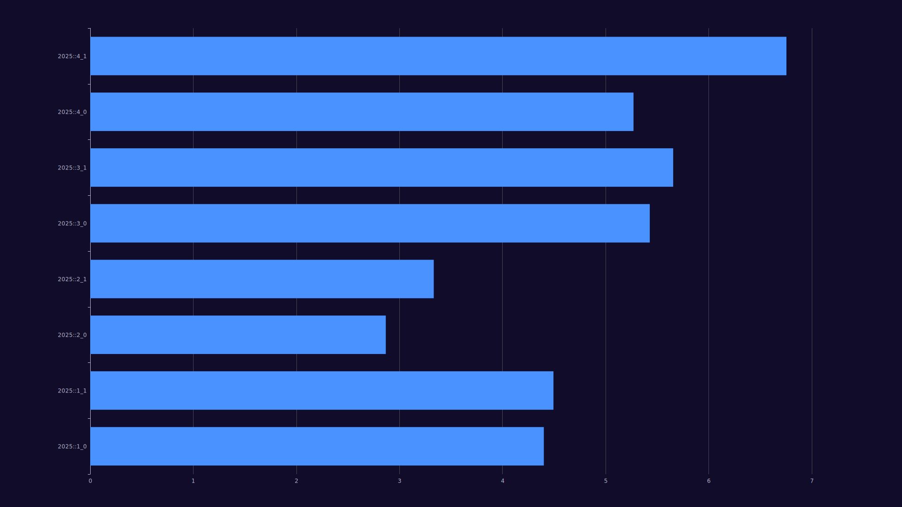

# Advent of Code 2024

## Mindset

I did not agree with many of the overbearing design decisions of the existing AOC frameworks so I made my own with even more overbearing design decisions that make it basically unusable for anyone else besides me, use it at your peril.

## Usage
### Run benchmarks with graphics and stats
``` bash
cargo install cargo-criterion
cargo bench --features criterion
```
output will be in `target/criterion/index.html`

### See the CLI help menu
``` bash
cargo run -- --help
```

### Run individual days
``` bash
cargo run -- --target-day day01_0
```

### Run days based on a glob
``` bash
cargo run -- --target-day "day01_*"
```

### Run all days with their outputs hidden
``` bash
cargo run --release -- -o
```

### Enable benchmarks
``` bash
cargo run --release -- -b
```

### Generate the benchmark results table
``` bash
cargo run --release -- -B
```

### Generate the benchmark results graph
``` bash
cargo run --release -- -g
```

## Current benchmarks

These benchmarks were done without any true care for accuracy or attempting to control external variables so take them with a grain of salt:

Log scale benchmark results:



Results table:

<!-- Table insert start -->
<table>    <thead>        <tr>            <th>                <div>                    <p>                        Day                    </p>                </div>            </th>            <th>                <div>                    <p>                        Validated                    </p>                </div>            </th>            <th>                <div>                    <p>                        Average time                    </p>                </div>            </th>            <th>                <div>                    <p>                        Samples                    </p>                </div>            </th>            <th>                <div>                    <p>                        Total time                    </p>                </div>            </th>        </tr>    </thead>    <tbody>        <tr>            <td>                <div>                    <p>                        2024::day01_0                    </p>                </div>            </td>            <td>                <div>                    <p>                        true                    </p>                </div>            </td>            <td>                <div>                    <p>                        24.954us                    </p>                </div>            </td>            <td>                <div>                    <p>                        40k                    </p>                </div>            </td>            <td>                <div>                    <p>                        1.000s                    </p>                </div>            </td>        </tr>        <tr>            <td>                <div>                    <p>                        2024::day01_1                    </p>                </div>            </td>            <td>                <div>                    <p>                        true                    </p>                </div>            </td>            <td>                <div>                    <p>                        37.355us                    </p>                </div>            </td>            <td>                <div>                    <p>                        26k                    </p>                </div>            </td>            <td>                <div>                    <p>                        1.000s                    </p>                </div>            </td>        </tr>        <tr>            <td>                <div>                    <p>                        2024::day02_0                    </p>                </div>            </td>            <td>                <div>                    <p>                        true                    </p>                </div>            </td>            <td>                <div>                    <p>                        125.942us                    </p>                </div>            </td>            <td>                <div>                    <p>                        7k                    </p>                </div>            </td>            <td>                <div>                    <p>                        1.000s                    </p>                </div>            </td>        </tr>        <tr>            <td>                <div>                    <p>                        2024::day02_1                    </p>                </div>            </td>            <td>                <div>                    <p>                        true                    </p>                </div>            </td>            <td>                <div>                    <p>                        144.456us                    </p>                </div>            </td>            <td>                <div>                    <p>                        6k                    </p>                </div>            </td>            <td>                <div>                    <p>                        1.000s                    </p>                </div>            </td>        </tr>        <tr>            <td>                <div>                    <p>                        2024::day03_0                    </p>                </div>            </td>            <td>                <div>                    <p>                        true                    </p>                </div>            </td>            <td>                <div>                    <p>                        98.027us                    </p>                </div>            </td>            <td>                <div>                    <p>                        10k                    </p>                </div>            </td>            <td>                <div>                    <p>                        1.000s                    </p>                </div>            </td>        </tr>        <tr>            <td>                <div>                    <p>                        2024::day03_1                    </p>                </div>            </td>            <td>                <div>                    <p>                        true                    </p>                </div>            </td>            <td>                <div>                    <p>                        140.108us                    </p>                </div>            </td>            <td>                <div>                    <p>                        7k                    </p>                </div>            </td>            <td>                <div>                    <p>                        1.000s                    </p>                </div>            </td>        </tr>        <tr>            <td>                <div>                    <p>                        2024::day04_0                    </p>                </div>            </td>            <td>                <div>                    <p>                        true                    </p>                </div>            </td>            <td>                <div>                    <p>                        274.639us                    </p>                </div>            </td>            <td>                <div>                    <p>                        3k                    </p>                </div>            </td>            <td>                <div>                    <p>                        1.000s                    </p>                </div>            </td>        </tr>        <tr>            <td>                <div>                    <p>                        2024::day04_1                    </p>                </div>            </td>            <td>                <div>                    <p>                        true                    </p>                </div>            </td>            <td>                <div>                    <p>                        23.764us                    </p>                </div>            </td>            <td>                <div>                    <p>                        42k                    </p>                </div>            </td>            <td>                <div>                    <p>                        1.000s                    </p>                </div>            </td>        </tr>        <tr>            <td>                <div>                    <p>                        2024::day05_0                    </p>                </div>            </td>            <td>                <div>                    <p>                        true                    </p>                </div>            </td>            <td>                <div>                    <p>                        43.183us                    </p>                </div>            </td>            <td>                <div>                    <p>                        23k                    </p>                </div>            </td>            <td>                <div>                    <p>                        1.000s                    </p>                </div>            </td>        </tr>        <tr>            <td>                <div>                    <p>                        2024::day05_1                    </p>                </div>            </td>            <td>                <div>                    <p>                        true                    </p>                </div>            </td>            <td>                <div>                    <p>                        112.193us                    </p>                </div>            </td>            <td>                <div>                    <p>                        8k                    </p>                </div>            </td>            <td>                <div>                    <p>                        1.000s                    </p>                </div>            </td>        </tr>        <tr>            <td>                <div>                    <p>                        2024::day06_0                    </p>                </div>            </td>            <td>                <div>                    <p>                        true                    </p>                </div>            </td>            <td>                <div>                    <p>                        89.779us                    </p>                </div>            </td>            <td>                <div>                    <p>                        11k                    </p>                </div>            </td>            <td>                <div>                    <p>                        1.000s                    </p>                </div>            </td>        </tr>        <tr>            <td>                <div>                    <p>                        2024::day06_1                    </p>                </div>            </td>            <td>                <div>                    <p>                        true                    </p>                </div>            </td>            <td>                <div>                    <p>                        4.682ms                    </p>                </div>            </td>            <td>                <div>                    <p>                        214                    </p>                </div>            </td>            <td>                <div>                    <p>                        1.002s                    </p>                </div>            </td>        </tr>        <tr>            <td>                <div>                    <p>                        2024::day07_0                    </p>                </div>            </td>            <td>                <div>                    <p>                        true                    </p>                </div>            </td>            <td>                <div>                    <p>                        456.082us                    </p>                </div>            </td>            <td>                <div>                    <p>                        2k                    </p>                </div>            </td>            <td>                <div>                    <p>                        1.001s                    </p>                </div>            </td>        </tr>        <tr>            <td>                <div>                    <p>                        2024::day07_1                    </p>                </div>            </td>            <td>                <div>                    <p>                        true                    </p>                </div>            </td>            <td>                <div>                    <p>                        83.786ms                    </p>                </div>            </td>            <td>                <div>                    <p>                        12                    </p>                </div>            </td>            <td>                <div>                    <p>                        1.005s                    </p>                </div>            </td>        </tr>        <tr>            <td>                <div>                    <p>                        2024::day08_0                    </p>                </div>            </td>            <td>                <div>                    <p>                        true                    </p>                </div>            </td>            <td>                <div>                    <p>                        18.984us                    </p>                </div>            </td>            <td>                <div>                    <p>                        52k                    </p>                </div>            </td>            <td>                <div>                    <p>                        1.000s                    </p>                </div>            </td>        </tr>        <tr>            <td>                <div>                    <p>                        2024::day08_1                    </p>                </div>            </td>            <td>                <div>                    <p>                        true                    </p>                </div>            </td>            <td>                <div>                    <p>                        40.354us                    </p>                </div>            </td>            <td>                <div>                    <p>                        24k                    </p>                </div>            </td>            <td>                <div>                    <p>                        1.000s                    </p>                </div>            </td>        </tr>        <tr>            <td>                <div>                    <p>                        2024::day09_0                    </p>                </div>            </td>            <td>                <div>                    <p>                        true                    </p>                </div>            </td>            <td>                <div>                    <p>                        224.606us                    </p>                </div>            </td>            <td>                <div>                    <p>                        4k                    </p>                </div>            </td>            <td>                <div>                    <p>                        1.000s                    </p>                </div>            </td>        </tr>        <tr>            <td>                <div>                    <p>                        2024::day09_1                    </p>                </div>            </td>            <td>                <div>                    <p>                        true                    </p>                </div>            </td>            <td>                <div>                    <p>                        36.370ms                    </p>                </div>            </td>            <td>                <div>                    <p>                        28                    </p>                </div>            </td>            <td>                <div>                    <p>                        1.018s                    </p>                </div>            </td>        </tr>        <tr>            <td>                <div>                    <p>                        2024::day10_0                    </p>                </div>            </td>            <td>                <div>                    <p>                        true                    </p>                </div>            </td>            <td>                <div>                    <p>                        111.547us                    </p>                </div>            </td>            <td>                <div>                    <p>                        8k                    </p>                </div>            </td>            <td>                <div>                    <p>                        1.000s                    </p>                </div>            </td>        </tr>        <tr>            <td>                <div>                    <p>                        2024::day10_1                    </p>                </div>            </td>            <td>                <div>                    <p>                        true                    </p>                </div>            </td>            <td>                <div>                    <p>                        21.948us                    </p>                </div>            </td>            <td>                <div>                    <p>                        45k                    </p>                </div>            </td>            <td>                <div>                    <p>                        1.000s                    </p>                </div>            </td>        </tr>        <tr>            <td>                <div>                    <p>                        2024::day11_0                    </p>                </div>            </td>            <td>                <div>                    <p>                        true                    </p>                </div>            </td>            <td>                <div>                    <p>                        190.813ns                    </p>                </div>            </td>            <td>                <div>                    <p>                        100k                    </p>                </div>            </td>            <td>                <div>                    <p>                        19.081ms                    </p>                </div>            </td>        </tr>        <tr>            <td>                <div>                    <p>                        2024::day11_1                    </p>                </div>            </td>            <td>                <div>                    <p>                        true                    </p>                </div>            </td>            <td>                <div>                    <p>                        191.450ns                    </p>                </div>            </td>            <td>                <div>                    <p>                        100k                    </p>                </div>            </td>            <td>                <div>                    <p>                        19.145ms                    </p>                </div>            </td>        </tr>        <tr>            <td>                <div>                    <p>                        2024::day12_0                    </p>                </div>            </td>            <td>                <div>                    <p>                        true                    </p>                </div>            </td>            <td>                <div>                    <p>                        305.913us                    </p>                </div>            </td>            <td>                <div>                    <p>                        3k                    </p>                </div>            </td>            <td>                <div>                    <p>                        1.000s                    </p>                </div>            </td>        </tr>        <tr>            <td>                <div>                    <p>                        2024::day12_1                    </p>                </div>            </td>            <td>                <div>                    <p>                        true                    </p>                </div>            </td>            <td>                <div>                    <p>                        454.952us                    </p>                </div>            </td>            <td>                <div>                    <p>                        2k                    </p>                </div>            </td>            <td>                <div>                    <p>                        1.000s                    </p>                </div>            </td>        </tr>        <tr>            <td>                <div>                    <p>                        2024::day13_0                    </p>                </div>            </td>            <td>                <div>                    <p>                        true                    </p>                </div>            </td>            <td>                <div>                    <p>                        36.571us                    </p>                </div>            </td>            <td>                <div>                    <p>                        27k                    </p>                </div>            </td>            <td>                <div>                    <p>                        1.000s                    </p>                </div>            </td>        </tr>        <tr>            <td>                <div>                    <p>                        2024::day13_1                    </p>                </div>            </td>            <td>                <div>                    <p>                        true                    </p>                </div>            </td>            <td>                <div>                    <p>                        36.540us                    </p>                </div>            </td>            <td>                <div>                    <p>                        27k                    </p>                </div>            </td>            <td>                <div>                    <p>                        1.000s                    </p>                </div>            </td>        </tr>        <tr>            <td>                <div>                    <p>                        2024::day14_0                    </p>                </div>            </td>            <td>                <div>                    <p>                        true                    </p>                </div>            </td>            <td>                <div>                    <p>                        15.203us                    </p>                </div>            </td>            <td>                <div>                    <p>                        65k                    </p>                </div>            </td>            <td>                <div>                    <p>                        1.000s                    </p>                </div>            </td>        </tr>        <tr>            <td>                <div>                    <p>                        2024::day14_1                    </p>                </div>            </td>            <td>                <div>                    <p>                        true                    </p>                </div>            </td>            <td>                <div>                    <p>                        56.764us                    </p>                </div>            </td>            <td>                <div>                    <p>                        17k                    </p>                </div>            </td>            <td>                <div>                    <p>                        1.000s                    </p>                </div>            </td>        </tr>        <tr>            <td>                <div>                    <p>                        2024::day15_0                    </p>                </div>            </td>            <td>                <div>                    <p>                        true                    </p>                </div>            </td>            <td>                <div>                    <p>                        194.202us                    </p>                </div>            </td>            <td>                <div>                    <p>                        5k                    </p>                </div>            </td>            <td>                <div>                    <p>                        1.000s                    </p>                </div>            </td>        </tr>        <tr>            <td>                <div>                    <p>                        2024::day15_1                    </p>                </div>            </td>            <td>                <div>                    <p>                        true                    </p>                </div>            </td>            <td>                <div>                    <p>                        411.039us                    </p>                </div>            </td>            <td>                <div>                    <p>                        2k                    </p>                </div>            </td>            <td>                <div>                    <p>                        1.000s                    </p>                </div>            </td>        </tr>        <tr>            <td>                <div>                    <p>                        2024::day16_0                    </p>                </div>            </td>            <td>                <div>                    <p>                        true                    </p>                </div>            </td>            <td>                <div>                    <p>                        2.039ms                    </p>                </div>            </td>            <td>                <div>                    <p>                        491                    </p>                </div>            </td>            <td>                <div>                    <p>                        1.001s                    </p>                </div>            </td>        </tr>        <tr>            <td>                <div>                    <p>                        2024::day16_1                    </p>                </div>            </td>            <td>                <div>                    <p>                        true                    </p>                </div>            </td>            <td>                <div>                    <p>                        20.015ms                    </p>                </div>            </td>            <td>                <div>                    <p>                        50                    </p>                </div>            </td>            <td>                <div>                    <p>                        1.001s                    </p>                </div>            </td>        </tr>        <tr>            <td>                <div>                    <p>                        2024::day17_0                    </p>                </div>            </td>            <td>                <div>                    <p>                        true                    </p>                </div>            </td>            <td>                <div>                    <p>                        485.789ns                    </p>                </div>            </td>            <td>                <div>                    <p>                        100k                    </p>                </div>            </td>            <td>                <div>                    <p>                        48.579ms                    </p>                </div>            </td>        </tr>        <tr>            <td>                <div>                    <p>                        2024::day17_1                    </p>                </div>            </td>            <td>                <div>                    <p>                        true                    </p>                </div>            </td>            <td>                <div>                    <p>                        40.801us                    </p>                </div>            </td>            <td>                <div>                    <p>                        24k                    </p>                </div>            </td>            <td>                <div>                    <p>                        1.000s                    </p>                </div>            </td>        </tr>        <tr>            <td>                <div>                    <p>                        2024::day18_0                    </p>                </div>            </td>            <td>                <div>                    <p>                        true                    </p>                </div>            </td>            <td>                <div>                    <p>                        464.095us                    </p>                </div>            </td>            <td>                <div>                    <p>                        2k                    </p>                </div>            </td>            <td>                <div>                    <p>                        1.000s                    </p>                </div>            </td>        </tr>        <tr>            <td>                <div>                    <p>                        2024::day18_1                    </p>                </div>            </td>            <td>                <div>                    <p>                        true                    </p>                </div>            </td>            <td>                <div>                    <p>                        1.841ms                    </p>                </div>            </td>            <td>                <div>                    <p>                        544                    </p>                </div>            </td>            <td>                <div>                    <p>                        1.002s                    </p>                </div>            </td>        </tr>        <tr>            <td>                <div>                    <p>                        2024::day19_0                    </p>                </div>            </td>            <td>                <div>                    <p>                        true                    </p>                </div>            </td>            <td>                <div>                    <p>                        51.887us                    </p>                </div>            </td>            <td>                <div>                    <p>                        19k                    </p>                </div>            </td>            <td>                <div>                    <p>                        1.000s                    </p>                </div>            </td>        </tr>        <tr>            <td>                <div>                    <p>                        2024::day19_1                    </p>                </div>            </td>            <td>                <div>                    <p>                        true                    </p>                </div>            </td>            <td>                <div>                    <p>                        3.800ms                    </p>                </div>            </td>            <td>                <div>                    <p>                        264                    </p>                </div>            </td>            <td>                <div>                    <p>                        1.003s                    </p>                </div>            </td>        </tr>        <tr>            <td>                <div>                    <p>                        2024::day20_0                    </p>                </div>            </td>            <td>                <div>                    <p>                        true                    </p>                </div>            </td>            <td>                <div>                    <p>                        509.106us                    </p>                </div>            </td>            <td>                <div>                    <p>                        1k                    </p>                </div>            </td>            <td>                <div>                    <p>                        1.000s                    </p>                </div>            </td>        </tr>        <tr>            <td>                <div>                    <p>                        2024::day20_1                    </p>                </div>            </td>            <td>                <div>                    <p>                        true                    </p>                </div>            </td>            <td>                <div>                    <p>                        3.201ms                    </p>                </div>            </td>            <td>                <div>                    <p>                        313                    </p>                </div>            </td>            <td>                <div>                    <p>                        1.002s                    </p>                </div>            </td>        </tr>        <tr>            <td>                <div>                    <p>                        2024::day21_0                    </p>                </div>            </td>            <td>                <div>                    <p>                        true                    </p>                </div>            </td>            <td>                <div>                    <p>                        412.929us                    </p>                </div>            </td>            <td>                <div>                    <p>                        2k                    </p>                </div>            </td>            <td>                <div>                    <p>                        1.000s                    </p>                </div>            </td>        </tr>        <tr>            <td>                <div>                    <p>                        2024::day21_1                    </p>                </div>            </td>            <td>                <div>                    <p>                        true                    </p>                </div>            </td>            <td>                <div>                    <p>                        3.598ms                    </p>                </div>            </td>            <td>                <div>                    <p>                        278                    </p>                </div>            </td>            <td>                <div>                    <p>                        1.000s                    </p>                </div>            </td>        </tr>        <tr>            <td>                <div>                    <p>                        2024::day22_0                    </p>                </div>            </td>            <td>                <div>                    <p>                        true                    </p>                </div>            </td>            <td>                <div>                    <p>                        8.875ms                    </p>                </div>            </td>            <td>                <div>                    <p>                        113                    </p>                </div>            </td>            <td>                <div>                    <p>                        1.003s                    </p>                </div>            </td>        </tr>        <tr>            <td>                <div>                    <p>                        2024::day22_1                    </p>                </div>            </td>            <td>                <div>                    <p>                        true                    </p>                </div>            </td>            <td>                <div>                    <p>                        131.603ms                    </p>                </div>            </td>            <td>                <div>                    <p>                        8                    </p>                </div>            </td>            <td>                <div>                    <p>                        1.053s                    </p>                </div>            </td>        </tr>        <tr>            <td>                <div>                    <p>                        2024::day23_0                    </p>                </div>            </td>            <td>                <div>                    <p>                        true                    </p>                </div>            </td>            <td>                <div>                    <p>                        473.254us                    </p>                </div>            </td>            <td>                <div>                    <p>                        2k                    </p>                </div>            </td>            <td>                <div>                    <p>                        1.000s                    </p>                </div>            </td>        </tr>        <tr>            <td>                <div>                    <p>                        2024::day23_1                    </p>                </div>            </td>            <td>                <div>                    <p>                        true                    </p>                </div>            </td>            <td>                <div>                    <p>                        94.278ms                    </p>                </div>            </td>            <td>                <div>                    <p>                        11                    </p>                </div>            </td>            <td>                <div>                    <p>                        1.037s                    </p>                </div>            </td>        </tr>        <tr>            <td>                <div>                    <p>                        2024::day24_0                    </p>                </div>            </td>            <td>                <div>                    <p>                        true                    </p>                </div>            </td>            <td>                <div>                    <p>                        122.043us                    </p>                </div>            </td>            <td>                <div>                    <p>                        8k                    </p>                </div>            </td>            <td>                <div>                    <p>                        1.000s                    </p>                </div>            </td>        </tr>        <tr>            <td>                <div>                    <p>                        2024::day24_1                    </p>                </div>            </td>            <td>                <div>                    <p>                        true                    </p>                </div>            </td>            <td>                <div>                    <p>                        27.785us                    </p>                </div>            </td>            <td>                <div>                    <p>                        35k                    </p>                </div>            </td>            <td>                <div>                    <p>                        1.000s                    </p>                </div>            </td>        </tr>        <tr>            <td>                <div>                    <p>                        2024::day25_0                    </p>                </div>            </td>            <td>                <div>                    <p>                        true                    </p>                </div>            </td>            <td>                <div>                    <p>                        128.520us                    </p>                </div>            </td>            <td>                <div>                    <p>                        7k                    </p>                </div>            </td>            <td>                <div>                    <p>                        1.000s                    </p>                </div>            </td>        </tr>        <tr>            <td>                <div>                    <p>                        2025::day01_0                    </p>                </div>            </td>            <td>                <div>                    <p>                        true                    </p>                </div>            </td>            <td>                <div>                    <p>                        23.448us                    </p>                </div>            </td>            <td>                <div>                    <p>                        42k                    </p>                </div>            </td>            <td>                <div>                    <p>                        1.000s                    </p>                </div>            </td>        </tr>        <tr>            <td>                <div>                    <p>                        totals                    </p>                </div>            </td>            <td>                <div>                    <p>                        true                    </p>                </div>            </td>            <td>                <div>                    <p>                        399.842ms                    </p>                </div>            </td>            <td>                <div>                    <p>                        927k                    </p>                </div>            </td>            <td>                <div>                    <p>                        47.218s                    </p>                </div>            </td>        </tr>    </tbody></table>
<!-- Table insert end -->
