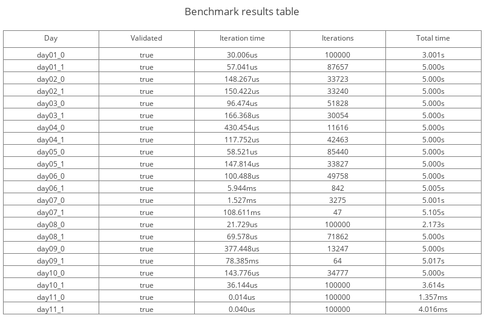
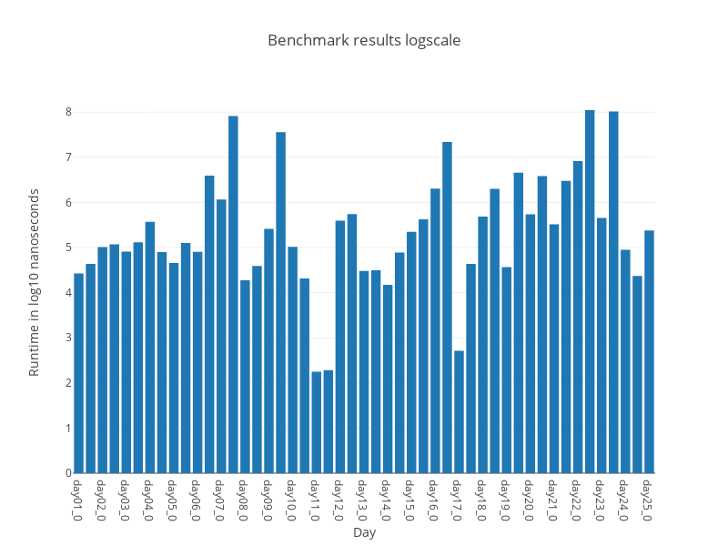

# Advent of Code 2024

## Mindset

This framework is meant to be easy to expand and iterate on. I hope to foster a collaborative atmosphere for solving these problems and make this a public repository for basic Rust.

## Current benchmarks

These benchmarks were done without any true care for accuracy or attempting to control external variables so take them with a grain of salt:



Log scale benchmark results:



## Notes

- When adding a day you must:
  - Copy an existing day file into the `src` directory
    - Ensure the numbering scheme is followed
  - Uncomment the newly added day file in the following places
    - `src/main.rs` -> to allow you to run the day using `cargo run`
    - `src/lib.rs` -> to include the new code in the binary
    - `benches/days.rs` -> to allow for benchmarking using `cargo criterion`

When developing solutions you will likely want to run using `cargo run` without the `--release` flag for faster compile times. For benchmarking however you should use the `--release` flag to get the highest level of optimization. Criterion will automatically use a high level of optimization.

## Usage
### Run benchmarks with graphics and stats
``` bash
cargo install cargo-criterion
cargo criterion
```
output will be in `target/criterion/index.html`

### See the CLI help menu
``` bash
cargo run -- --help
```

### Run individual days
``` bash
cargo run -- --target-day day01_0
```

### Run days based on a glob
``` bash
cargo run -- --target-day "day01_*"
```

### Run all days with their outputs hidden
``` bash
cargo run --release -- -o
```

### Enable benchmarks
``` bash
cargo run --release -- -b
```

### Generate the benchmark results table
``` bash
cargo run --release -- -B
```

### Generate the benchmark results graph
``` bash
cargo run --release -- -g
```
